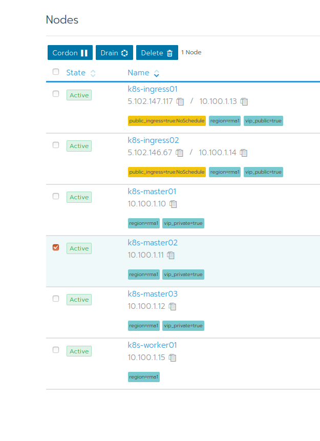

## Lab 3.4: Update Nodes

In order to update kubernetes node, we need to make sure that no application workload is on the node and kubnernetes does not schedule any new pods on this node. Afterwards, updating a node is really part of the kubernetes daily business and should be handled by your existing processes. All kubernetes related components (except for the container runtime) is handled by Rancher.

### Cordon a node

Cordon a node makes the node unscheduable for kubernetes. You can do this inside your Rancher WebGUI or with `kubectl`.



Select the node(s) and then click on de `Cordon` button.

With kubectl use the following command to cordon the node

```bash
kubectl cordon userX-k8snode3
```

### Drain a node

By draining your node, you can remove all running pods on the selected node. Kubernetes will schedule the pods on other nodes and also does repect available [Pod Disruption Budgets](https://kubernetes.io/docs/concepts/workloads/pods/disruptions/#how-disruption-budgets-work). Assuming your workload is designed the way it should be, no interruption of service is expected.

### Upgrade node

You can now upgrade your node using your existing maintance processess. 

```bash
# Example
yum update
reboot
```

### Uncordon node

Uncordon a node makes the node scheduable again for kubernetes. You can do this inside your Rancher WebGUI or with kubectl.

Select the node(s) and then click on de `Uncordon` button.

With kubectl use the following command to cordon the node

```bash
kubectl uncordon userX-k8snode3
```

**End of Lab 3.4**

<p width="100px" align="right"><a href="35_certificaterotation.md"> 3.4 Certificate Rotation →</a></p>

[← back to the Chapter Overview](10_rancher.md)
