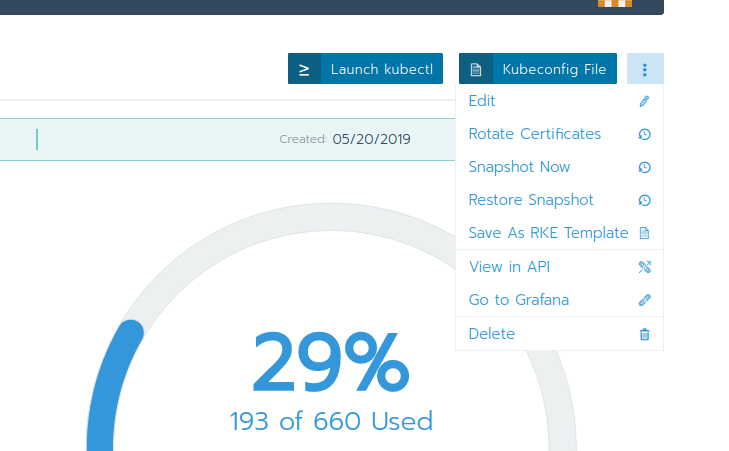

## Lab 3.5: Certificate Rotation

By default, Kubernetes clusters require certificates and Rancher launched Kubernetes clusters automatically generate certificates for the Kubernetes components. Rotating these certificates is important before the certificates expire as well as if a certificate is compromised. After the certificates are rotated, the Kubernetes components are automatically restarted. Check the [Rancher Documentation](https://rancher.com/docs/rancher/v2.x/en/cluster-admin/certificate-rotation/) for more details.

Certificates can be rotated for the following services:

* etcd
* kubelet
* kube-apiserver
* kube-proxy
* kube-scheduler
* kube-controller-manager

### Rotate all certificates

Rancher launched Kubernetes clusters have the ability to rotate the auto-generated certificates through the UI. You can rotate all your certificates using the Rancher Webgui.

And then you can select to rotate all certificates at once or only rotate indiviual

Click on Save to rotate the certificates. The cluster will go into update mode, wait until the cluster is ready again.

Beaware, after the certificates are rotated, the Kubernetes components are automatically restarted. You should do this inside a maintenance window.

**End of Lab 3.5**

<a href="36_persistentstorage.md"> 3.6 Persistent Storage→</a>

[← back to the Chapter Overview](10_rancher.md)
