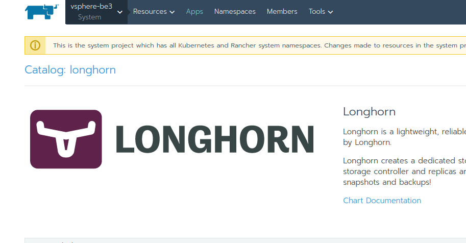
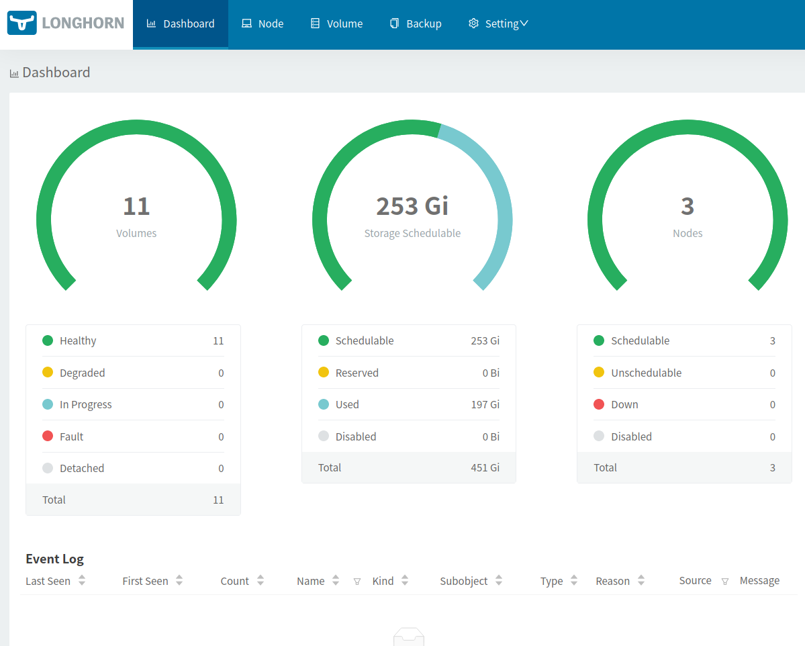
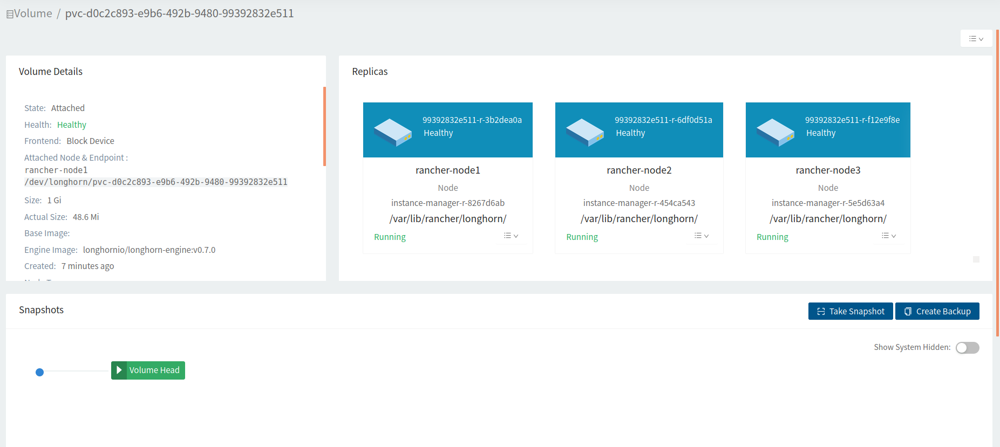

## Lab 3.6: Persistent Storage

In this lab we are going to install [Longhorn](https://github.com/longhorn/longhorn), a Cloud-Native distributed block storage. Longhorn is a [CNCF Sandbox](https://thenewstack.io/rancher-donates-its-longhorn-kubernetes-persistent-storage-software-to-cncf/) Project, we do not yet recommend this in a production setup. For this lab purpose, its an easy solution to provide storage to your Pods.

## Install Project Longhorn using Rancher App Catalog

Go to your system project and open the `Apps` page. Search for Longhorn and launce a new longhorn instance. You can leave all settings on default.

As soon as your longhorn instance is `Active`, you can open the longhorn webgui to see all nodes and volumes. There should be no volume at the moment.

## Create a new Persistent Volume Claim (PVC)

Longhorn does also create a new Storage Class as marks it as the default storage class.

For testing, we are going to create a new Volume. Go to the "Default" Project and open the page "Resources/Workload" and then switch to the "Volumes" tab. Click on add Volume.

Create a new `test` volume with 1 GiB Size. In the Longhorn Webgui you should see now a new Volume which is Detached (as we have not yet mounted the volume in a pod):

## Mount the volume inside a pod

You can now create a new Pod and mount the volume. Create a new Deployment inside your default Namespace. Give it a name `test` and use the `busybox` container image. You can now select the already existing PVC under Volumes (`Add Volume` / `Use existing persistent volume`) and select the previusly created PVC. You can mount the volume at `/mnt`. Launch de deployment and open a shell from the newly created pod to verify the mountpoint (e.g. `df -h`).

Inside the Longhorn Webgui, you should see that the volume is getting attached and as soon as it is attached you can verify all replicas for this volume.

**End of Lab 3.6**

<a href="40_backuprestore.md">4 Backup and Restore→</a>

[← back to the Chapter Overview](10_rancher.md)
