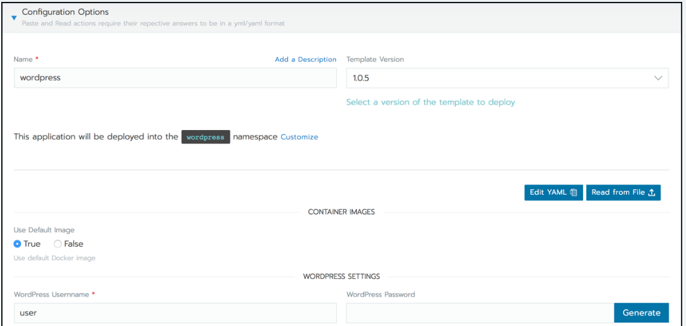

# Lab 6.3: Use your own Rancher Charts

**Helm Charts**: Native Helm charts include an application along with other software required to run it. When deploying native Helm charts, you’ll learn the chart’s parameters and then configure them using Answers, which are sets of key value pairs.

**Rancher Charts**: Rancher charts mirror native helm charts, although they add two files that enhance user experience: `app-readme.md` and `questions.yaml`.

* `app-readme.md`: A file that provides descriptive text in the chart’s UI header.
* `questions.yml`: A file that contains questions for a form. These form questions simplify deployment of a chart. Without it, you must configure the deployment using key value pairs, which is more difficult.


## Create Rancher Chart

Create a new chart called `mychart`.

```bash
$ helm create mychart
```

This command will create a directory structure like below.

```bash
mychart
|-- Chart.yaml          # Required Helm chart information file.
|-- charts              # Directory containing dependency charts.
|-- templates           # Directory containing templates that, when combined with values.yml, generates Kubernetes YAML.
|   |-- NOTES.txt
|   |-- _helpers.tpl
|   |-- deployment.yaml
|   |-- ingress.yaml
|   `-- service.yaml
`-- values.yaml         # Default configuration values for the chart.
```

This basically is only a Helm Chart but we actually would like to have a Rancher Chart. So we need to add the following 2 files.

```bash
mychart       
|-- app-readme.md  # Text displayed in the charts header within the Rancher UI.
|-- questions.yml  # Form questions displayed within the Rancher UI. Questions display in Configuration Options.  
```

Add some text to the `app-readme.md` file.
```bash
$ echo '# Simple NGINX APP!' > app-readme.md
```

Also add some questions that should be promted on the WebUi when installing the rancher chart. Add the following content to `questions.yml`.
```yaml
categories:
- Web
- Proxy
questions:
- variable: deploymenttitle
default: "foobar"
description: "Set a name for the deployment"
type: string
required: true
label: Nginx deploymenttitle set
```

As we have added a question to the `questions.yaml` we can now use the variable-name `deploymenttitle` of that question in our templates. We use it in the `deployment.yaml` file. Adjust it to match the following:

```bash
apiVersion: apps/v1
kind: Deployment
metadata:
  name: "{{ .Values.deploymenttitle }}"
  labels:
```

Before applying our own chart we still want to perform a syntax check to prevent potential errors.
```bash
$ helm lint ./mychart
==> Linting ./mychart
[INFO] Chart.yaml: icon is recommended

1 chart(s) linted, 0 chart(s) failed
```
The Chart is now ready for installation.

---

<p width="100px" align="right"><a href="64_managehelmcharts.md">6.4 Install the Chart →</a></p>

[← back to the Labs Overview](../README.md)